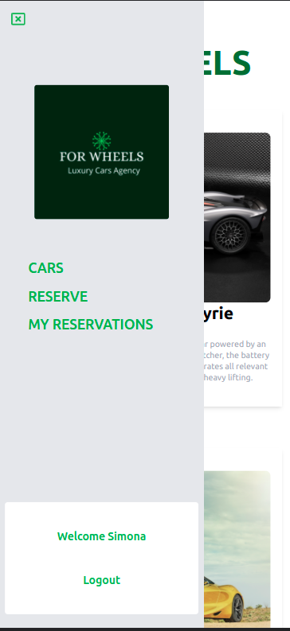

# FOR WHEELS

> A SPA (single page application) for a luxury renting cars agency: For Wheels!

Rent one of a kind car, your dream car for **For Wheels**!!
This SPA takes the information from the back-end API developed by us and, accordingly to the user interaction, consumes it and renders the data on the UI.

## Built With

- Major languages: JavaScript
- Frameworks: React
- Technologies used: Tailwind, Redux 

## Live Demo -not yet**

[Live Demo Link](https://livedemo.com)

## Kanban Board
Please hind Kandban board [here](https://github.com/users/nicupop729/projects/3);
## Getting Started

To get a local copy up and running follow these simple example steps.

### Prerequisites
In order to run this project on your system, please make sure that you have installed all of the followings:
 - IDE application
 - node.js
 - npm packages
 - a web browser
### Setup

 - open your terminal and run the following command: `git clone https://github.com/nicupop729/for_wheels.git`;
 - Run the command `cd for_wheels`;
 - Run the command `npm install`;
 - Run the command `npm start`;

Once you completed this steps you should see the app running at: http://localhost:3000/ in your browser.

## Authors

👤 **Jonathas Tavares**

- GitHub: [jonathastavares](https://github.com/jonathastavares)
- LinkedIn: [Jonathas Tavares](https://www.linkedin.com/in/jonathas-tavares-24b8bba3/)

👤 **Nicolae Pop**

- GitHub: [@nicupop729](https://github.com/nicupop729)
- Twitter: [@nicupop729](https://twitter.com/nicupop729)
- LinkedIn: [LinkedIn](https://www.linkedin.com/in/nicolae-pop/)

## 🤝 Contributing

Contributions, issues, and feature requests are welcome!

Feel free to check the [issues page](../../issues/).

## Show your support

Give a ⭐️ if you like this project!

## Acknowledgments

- Thanks to [Murat Korkmaz](https://www.behance.net/muratk) for the [UI design](https://www.behance.net/gallery/26425031/Vespa-Responsive-Redesign).
- Thanks to [Microverse](https://www.microverse.org/) for the fabulous environment to learn web development.

## 📝 License

This project is [MIT](./MIT.md) licensed.
